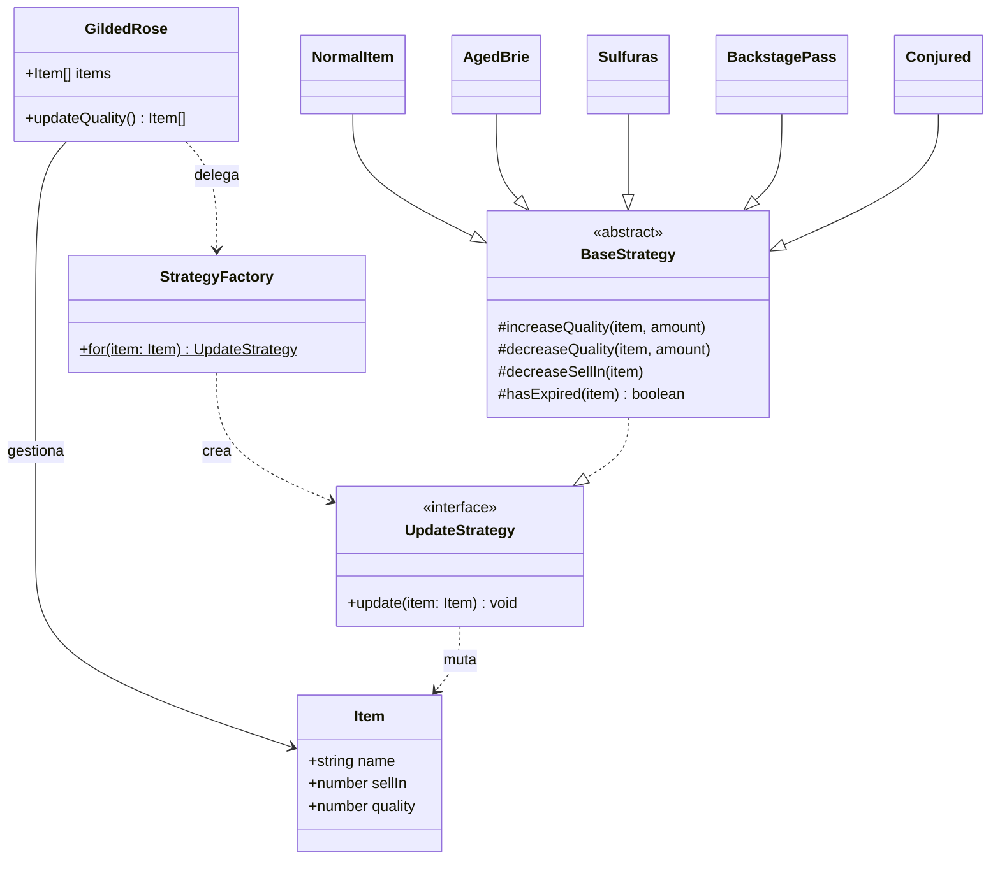

# Desafío 1 — Gilded Rose (Strategy + Factory)

Refactorización del célebre kata **Gilded Rose** (Terry Hughes): tomar un método
masivo, anidado y altamente condicional de **código legado** y rediseñarlo en una
arquitectura **cerrada a la modificación pero abierta a la extensión** (OCP),
agregando además el nuevo requisito de los artículos **Conjured**.

## Reglas de negocio

Al final de cada jornada, todos los artículos reducen su `sellIn`, y su `quality`
varía según la categoría:

| Categoría | Comportamiento |
|-----------|----------------|
| **Normal** | `quality −1`/día; `−2` tras expirar (`sellIn < 0`). Nunca < 0. |
| **Aged Brie** | `quality +1`/día; `+2` tras expirar. Nunca > 50. |
| **Sulfuras** (legendario) | Nunca cambia: `sellIn` fijo y `quality` constante en 80. |
| **Backstage passes** | `+1`; `+2` con ≤10 días; `+3` con ≤5 días; cae a **0** tras el evento. Nunca > 50. |
| **Conjured** | Degrada el doble que un normal: `−2`/día; `−4` tras expirar. Nunca < 0. |

> **Restricción del kata:** está prohibido modificar la clase de datos base
> `Item`. Todo el rediseño ocurre en la clase gestora y en las estrategias.

## Decisiones de diseño

### Patrón Strategy
El cálculo de degradación **es lo que varía** según la categoría. Cada categoría
encapsula su algoritmo en una clase que implementa `UpdateStrategy`. Así cada
clase tiene **una sola responsabilidad** (SRP) y el motor no necesita conocer los
detalles de cada regla.

### Patrón Factory
Como `Item` solo guarda datos primitivos y no podemos modificarla,
`StrategyFactory` decide en tiempo de ejecución —a partir del **nombre**— qué
estrategia corresponde. Centraliza la creación y elimina los condicionales del
motor. Las estrategias son **stateless**, por lo que se reutilizan como
singletons internos de la fábrica.

### Open/Closed en acción
Agregar **Conjured** consistió únicamente en:
1. crear `strategies/Conjured.ts`, y
2. añadir **una línea** en la fábrica.

El motor `GildedRose` y la clase `Item` quedaron **intactos**.

### Fijación de límites centralizada
La clase base `BaseStrategy` concentra el *clamping* (`0 ≤ quality ≤ 50`) en
`increaseQuality` / `decreaseQuality`, en lugar de repetir esas comprobaciones en
cada estrategia.

## Diagrama de clases (UML)



## Estructura

```
src/
  Item.ts                 # clase de datos base (NO se modifica)
  GildedRose.ts           # motor refactorizado (delega en la estrategia)
  StrategyFactory.ts      # Factory: nombre -> estrategia
  strategies/
    UpdateStrategy.ts     # interfaz + BaseStrategy con clamping
    NormalItem.ts
    AgedBrie.ts
    Sulfuras.ts
    BackstagePass.ts
    Conjured.ts
  legacy/
    GildedRoseLegacy.ts   # código original (solo como baseline de pruebas)
tests/
  golden-master.test.ts   # equivalencia refactor == legado (caracterización)
  rules.test.ts           # reglas de negocio por categoría (incl. Conjured)
main.ts                   # prueba de concepto en consola
```

## Pruebas — Golden Master Testing

El código legado no tenía pruebas. Antes de refactorizar agresivamente se aplica
la técnica **Golden Master**: se registra el comportamiento exacto del programa
original para un volumen masivo de entradas y se usa como "copia maestra dorada".

`golden-master.test.ts` genera una batería exhaustiva (4 categorías × 19 valores
de `sellIn` × 8 de `quality`) y la avanza **50 días** con la versión **legada** y
la **refactorizada**, exigiendo estado idéntico en cada paso. Esto garantiza que
Strategy + Factory **no alteraron el comportamiento base**.

`rules.test.ts` valida cada regla por categoría, incluyendo el nuevo
comportamiento **Conjured** (que el legado no contemplaba).

## Ejecutar

```bash
npm install
npm start   # demo en consola (12 días de inventario)
npm test    # 14 pruebas (golden master + reglas)
```
