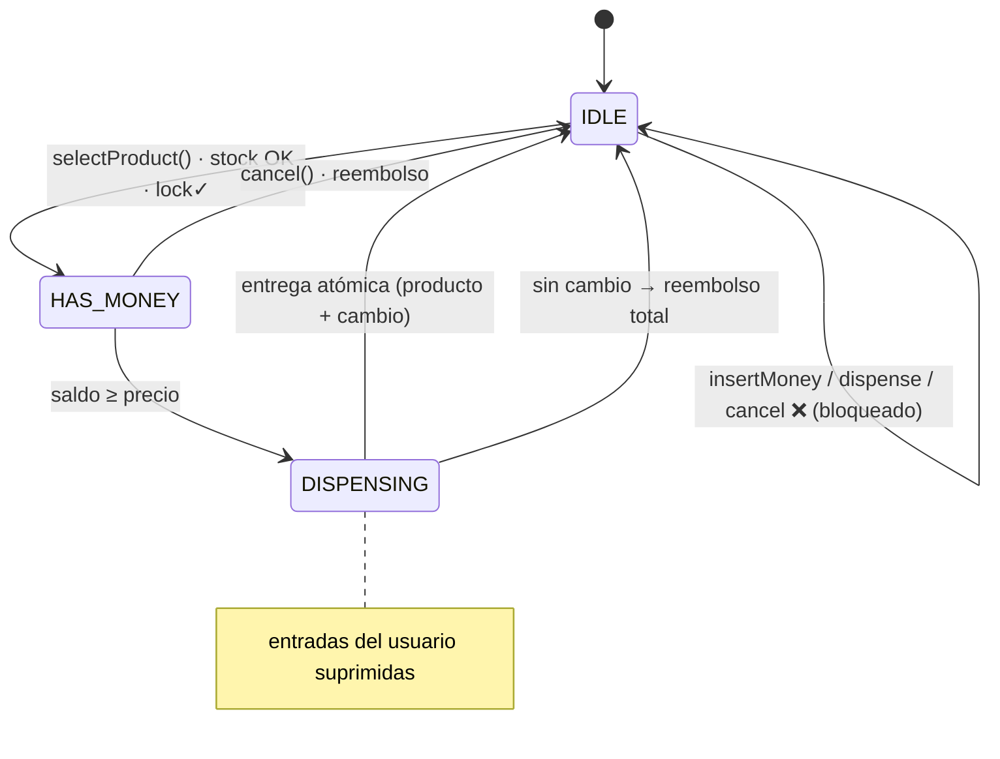
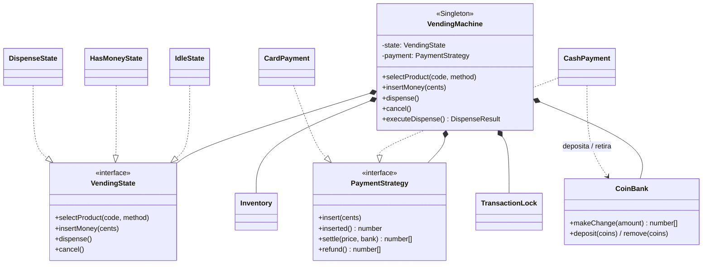

# Desafío 2 — Máquina Expendedora (State + Singleton + Strategy)

Diseño de bajo nivel (LLD) del software interno de una **máquina expendedora**.
El foco está en la **gestión del estado**, la **atomicidad de las transacciones**
y el **control de concurrencia** (una transacción a la vez).

## Requisitos cubiertos

- Catálogo de productos (código, precio, stock) y visualización del inventario.
- Selección por código + inserción de pagos en múltiples denominaciones.
- Dispensa el producto y devuelve el **cambio exacto**; descuenta la venta.
- **Bloqueos**: no inicia transacción si el producto está agotado **o** si no hay
  denominaciones para dar el cambio.
- Interfaz de **administrador**: reabastecer productos y extraer fondos.
- **Cancelación** en cualquier momento previo a la dispensación → reembolso total.
- **Atomicidad**: el usuario recibe *producto + cambio correcto*, **o** *nada y
  reembolso íntegro*. Nunca un estado intermedio corrupto.
- **Concurrencia**: una única transacción a la vez (TransactionLock).

## Patrones aplicados

### State (pilar del diseño)
Una expendedora es un **sistema impulsado por su estado**. Cada estado encapsula
qué operaciones son legales y a qué estado se transiciona, blindando el sistema
contra secuencias ilegales (dispensar sin pagar, cancelar tras entregar…).



### Singleton
El hardware es un **recurso singular**: `VendingMachine.getInstance()` asegura un
único controlador global, evitando estados paralelos contradictorios.

### Strategy
Las **pasarelas de pago** (`CashPayment`, `CardPayment`) son intercambiables. Se
puede agregar contactless / billeteras / APIs creando una nueva clase **sin tocar
la máquina de estados** (Open/Closed).

## Diagrama de clases (UML)



## Atomicidad y precisión

- Todo el dinero se modela en **centavos enteros** (sin floats).
- `CoinBank.makeChange` **planifica sobre una copia** y solo confirma si logra el
  monto exacto; ante imposibilidad no muta nada y devuelve `null`.
- En la dispensación: si no hay cambio, se hace `refund()` íntegro, **no se
  descuenta stock** y se vuelve a `IDLE`. O todo, o nada.

> Nota: `makeChange` usa un algoritmo voraz limitado por stock. Para el set de
> denominaciones canónico por defecto es óptimo; con sets no canónicos podría
> reportar un falso "sin cambio".

## Estructura

```
src/
  VendingMachine.ts        # Contexto (State) + Singleton
  TransactionLock.ts       # mutex lógico: una transacción a la vez
  errors.ts
  models/   Money.ts · Product.ts · Inventory.ts · CoinBank.ts
  states/   VendingState.ts · IdleState.ts · HasMoneyState.ts · DispenseState.ts
  payment/  PaymentStrategy.ts · CashPayment.ts · CardPayment.ts · PaymentFactory.ts
  main.ts                  # prueba de concepto en consola
tests/
  vending.test.ts          # 14 pruebas (compra, cambio, atomicidad, concurrencia, admin)
```

## Ejecutar

```bash
npm install
npm start   # demo en consola
npm test    # 14 pruebas
```
