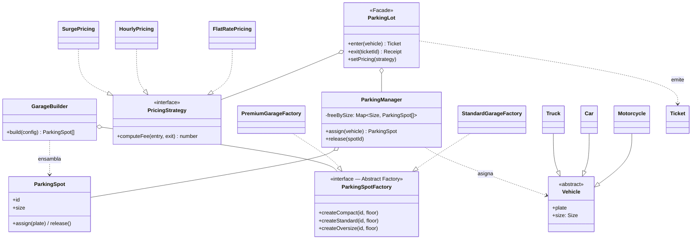

# Desafío 3 — Estacionamiento (Facade + Strategy + Abstract Factory)

Diseño de bajo nivel (LLD) del backend de un garaje de estacionamiento por
niveles: abstrae recursos físicos limitados, asigna la mejor plaza en tiempo
constante y calcula precios dinámicos, con control de concurrencia.

## Requisitos cubiertos

- Flota heterogénea: **motocicletas (SMALL)**, **autos (MEDIUM)**, **camiones (LARGE)**.
- Compatibilidad unidireccional: un vehículo entra en una plaza de su tamaño o
  mayor; un camión **solo** en una plaza grande.
- Asignación automática de la plaza óptima (**Best-Fit**) al ingresar.
- **Ticket** con identificador único y marca temporal; validación anti-fraude en
  la salida; cálculo de tarifa por fracción horaria.
- **Rechazo inmediato** si no hay plaza compatible (evita embotellamientos).
- Reutilización de plazas tras la salida.
- **Concurrencia**: adquisición de plaza atómica (bloqueo pesimista) → sin doble
  asignación entre puertas simultáneas.

## Patrones aplicados

### Facade
`ParkingLot` expone una interfaz mínima (`enter` / `exit`) y absorbe la
complejidad de coordinar el gestor de disponibilidad, el motor de precios y la
emisión/validación de tickets.

### Strategy
El motor de precios (`PricingStrategy`) es intercambiable: `FlatRatePricing`,
`HourlyPricing`, `SurgePricing`. Se cambia incluso **en caliente**
(`setPricing`), sin tocar las rutas de salida (OCP).

### Abstract Factory
`ParkingSpotFactory` crea una **familia** de plazas; `StandardGarageFactory` y
`PremiumGarageFactory` (esta equipa cargadores EV) producen topologías distintas.
`GarageBuilder` ingiere una configuración y ensambla el garaje delegando en la
fábrica, aislando el algoritmo de construcción.

## Rendimiento — Best-Fit en O(1)

En lugar de iterar miles de plazas (O(n) por transacción), `ParkingManager`
mantiene un **pool de vacantes por tamaño** (`Map<Size, ParkingSpot[]>`).
Reclamar/liberar es un `pop`/`push` O(1); el Best-Fit revisa a lo sumo 3 buckets.
Nunca se recorren las plazas ocupadas.

## Diagrama de clases (UML)



## Estructura

```
src/
  ParkingLot.ts            # Facade
  ParkingManager.ts        # Best-Fit O(1) + bloqueo pesimista
  errors.ts
  models/    Size.ts · Vehicle.ts · ParkingSpot.ts · Ticket.ts
  pricing/   PricingStrategy.ts · FlatRatePricing.ts · HourlyPricing.ts · SurgePricing.ts
  factories/ ParkingSpotFactory.ts (Abstract Factory) · GarageBuilder.ts
  main.ts                  # prueba de concepto en consola
tests/
  parking.test.ts          # 14 pruebas (best-fit, compatibilidad, precios, concurrencia, fábricas)
```

## Ejecutar

```bash
npm install
npm start   # demo en consola
npm test    # 14 pruebas
```
