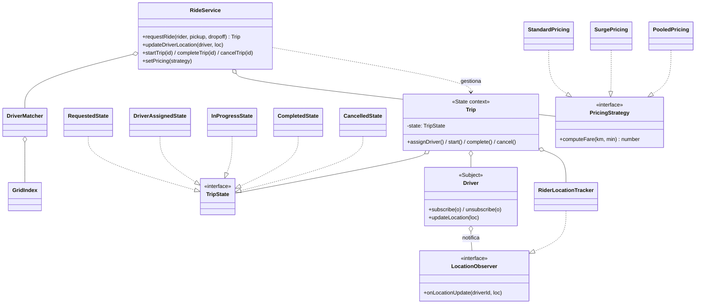

# Desafío 4 — Cab Booking / Ride-Sharing (Observer + Strategy + State)

Diseño de bajo nivel (LLD) del núcleo de una plataforma de reserva de viajes
tipo Uber: emparejamiento bajo demanda, telemetría en vivo y ciclo de vida del
viaje como máquina de estados auditable.

## Requisitos cubiertos

- **Matchmaking** del conductor más cercano por proximidad (desempate por tasa
  de aceptación).
- **Telemetría en tiempo real**: el pasajero recibe la ubicación del conductor en
  vivo y un ETA recalculado.
- **Ciclo de vida del viaje** como máquina de estados finita e inmutable, con
  transiciones ilegales bloqueadas.
- Tarifas **dinámicas** (estándar, surge, pool), intercambiables en caliente.
- Liberación del conductor y cierre del canal de telemetría al terminar/cancelar.

## Patrones aplicados

### Observer — telemetría conductor → pasajero
El `Driver` es el **Sujeto**: mantiene los observadores suscritos y los notifica
en cada `updateLocation` (simula un WebSocket persistente). El
`RiderLocationTracker` es el **Observador** que actualiza la vista y el ETA. Al
completar/cancelar, el servicio **desuscribe** y cierra el canal.

### Strategy — motor de tarifas
`PricingStrategy` se intercambia sin tocar el flujo: `StandardPricing`,
`SurgePricing` (multiplicador) y `PooledPricing` (descuento). Surge y pool
**componen** la estrategia base, reutilizando la fórmula.

### State — ciclo de vida del viaje
`Trip` delega en su estado actual. Transiciones legales:

```mermaid
stateDiagram-v2
    [*] --> REQUESTED
    REQUESTED --> DRIVER_ASSIGNED : assignDriver()
    REQUESTED --> CANCELLED : cancel()
    DRIVER_ASSIGNED --> IN_PROGRESS : start()
    DRIVER_ASSIGNED --> CANCELLED : cancel() · libera conductor
    IN_PROGRESS --> COMPLETED : complete() · calcula tarifa
    COMPLETED --> [*]
    CANCELLED --> [*]
    note right of IN_PROGRESS
      ya no se puede cancelar
      (servicio en consumo)
    end note
```



Esto impide incoherencias como cancelar un viaje ya completado y liquidado.

## Matchmaking geoespacial

Buscar al conductor más cercano recorriendo toda la flota es O(n) inviable a
escala. `GridIndex` **sectoriza** el plano en celdas; cada conductor vive en una
celda según su posición. `DriverMatcher` expande la búsqueda por anillos hasta
hallar disponibles, inspeccionando solo el entorno (no toda la flota). Al moverse
un conductor, se **reindexa** su celda.

## Diagrama de clases (UML)



## Estructura

```
src/
  RideService.ts           # orquestador (integra los 3 patrones)
  errors.ts
  models/     Location.ts · Rider.ts · Driver.ts (Subject) · Trip.ts (State ctx)
  states/     TripState.ts (interfaz+base) · TripStates.ts (5 estados)
  pricing/    PricingStrategy.ts · StandardPricing.ts · SurgePricing.ts · PooledPricing.ts
  observers/  LocationObserver.ts · RiderLocationTracker.ts
  matching/   GridIndex.ts (geo-grid) · DriverMatcher.ts (best match)
  main.ts                  # prueba de concepto en consola
tests/
  ride.test.ts             # 15 pruebas (matching, observer, state, strategy)
```

## Ejecutar

```bash
npm install
npm start   # demo en consola
npm test    # 15 pruebas
```
