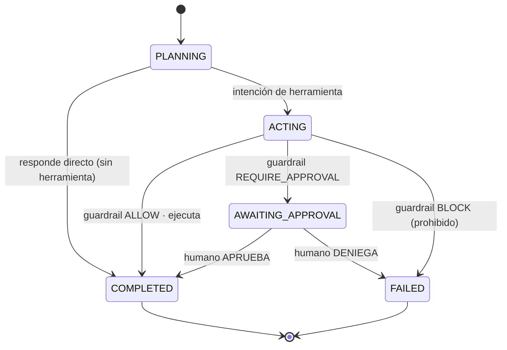
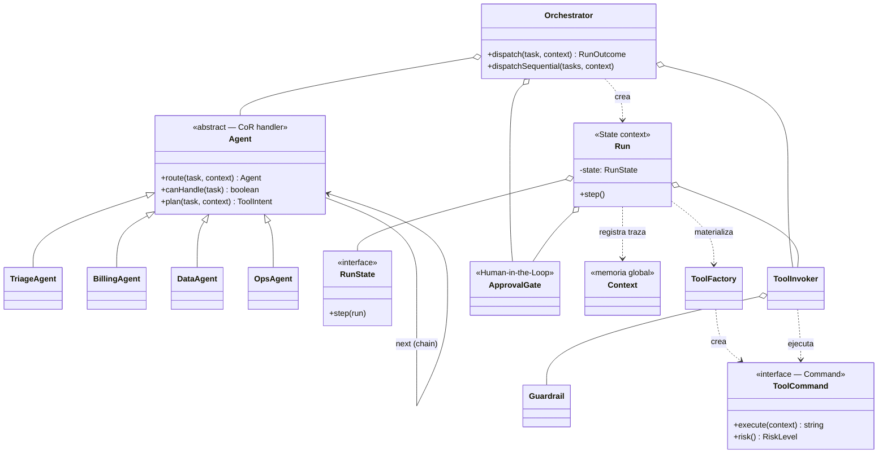

# Desafío 5 — Orquestación de Agentes IA (Command + State + Chain of Responsibility)

Diseño de bajo nivel (LLD) de un ecosistema multiagente que ingiere decisiones
intrínsecamente no deterministas (las de una IA) y las encauza por una
arquitectura **determinista y segura**: agentes que delegan, herramientas
controladas y un ciclo de vida auditable.

> No usa ningún LLM real: simula el razonamiento de los agentes con reglas, para
> centrarse en la **arquitectura OOP** (que es lo que el desafío evalúa).

## Requisitos cubiertos

- **Autonomía controlada**: los agentes acceden a herramientas potentes (DB, API,
  ejecución de código) pero detrás de **guardrails deterministas**.
- **Human-in-the-Loop**: las acciones destructivas se transfieren a un operador
  humano; las prohibidas se **bloquean** sin opción.
- **Orquestación**: delegación entre agentes especializados (Handoff).
- **Estado y memoria persistente**: contexto global compartido + máquina de
  estados auditable que habilita trazabilidad y reejecución.

## Patrones aplicados

### Command — Tool Gatekeeping
La intención del agente se expresa como **datos** (`ToolIntent`, esquema JSON).
`ToolFactory` la materializa en un `ToolCommand` concreto (`QueryDatabase`,
`CallApi`, `RunCode`, `DeleteRecords`). El `ToolInvoker` (receptor) intercepta el
comando, lo somete al guardrail y solo entonces lo ejecuta. Separa **decidir** de
**hacer**.

### Chain of Responsibility — Handoff
Los agentes forman una cadena `Triage → Billing → Data → Ops`. Cada uno evalúa si
puede resolver la tarea; si no, la **deriva** al siguiente. Si nadie puede, se
**escala** a un humano.

### State — ciclo de vida del Run
Cada ejecución (`Run`) es una máquina de estados:



## Guardrails (política determinista)

| Riesgo del comando | Veredicto | Ejemplo |
|--------------------|-----------|---------|
| `SAFE` | **ALLOW** | consulta DB, llamada API |
| `DESTRUCTIVE` | **REQUIRE_APPROVAL** (HITL) | borrado con filtro, ejecutar código |
| `FORBIDDEN` | **BLOCK** | borrado masivo / sobre infra protegida |

## Memoria y trazabilidad

`Context` es la memoria global compartida (blackboard) y mantiene una **traza**
cronológica de handoffs, transiciones de estado e invocaciones de herramientas.
Esa bitácora es la base de auditoría y reejecución que exige un flujo agentic
no-amnésico.

## Diagrama de clases (UML)



## Estructura

```
src/
  orchestrator/ Orchestrator.ts     # integra los 3 patrones + secuencial
  agents/       Agent.ts (CoR base) · Agents.ts (Triage/Billing/Data/Ops)
  run/          RunState.ts · RunStates.ts (5 estados) · Run.ts (State ctx)
  commands/     ToolCommand.ts · Commands.ts (4 comandos) · ToolFactory.ts
  guardrails/   Guardrail.ts · ApprovalGate.ts (Human-in-the-Loop)
  tools/        ToolInvoker.ts (receptor/gatekeeper)
  memory/       Context.ts (memoria global + traza)
  models/       Task.ts
  main.ts                            # prueba de concepto en consola
tests/
  orchestration.test.ts             # 13 pruebas (CoR, command/guardrail, state, factory)
```

## Ejecutar

```bash
npm install
npm start   # demo en consola (6 escenarios con trazas)
npm test    # 13 pruebas
```
